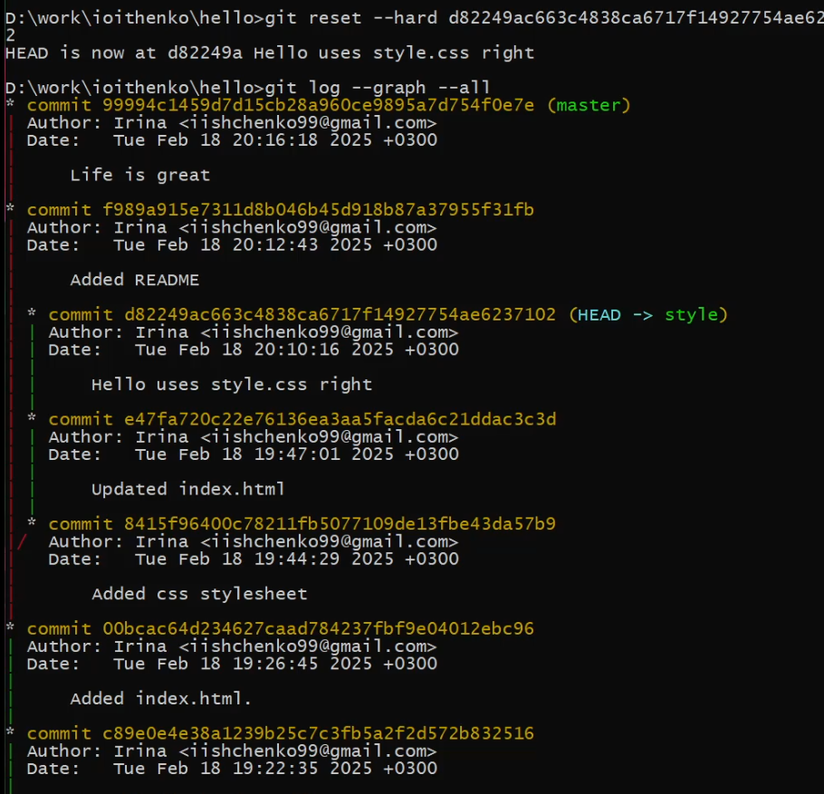

---
## Front matter
lang: ru-RU
title: Лабораторная работа №1
subtitle: Математическое моделирование
author:
  - Ищенко Ирина НПИбд-02-22
institute:
  - Российский университет дружбы народов, Москва, Россия

## i18n babel
babel-lang: russian
babel-otherlangs: english

## Formatting pdf
toc: false
toc-title: Содержание
slide_level: 2
aspectratio: 169
section-titles: true
theme: metropolis
header-includes:
 - \metroset{progressbar=frametitle,sectionpage=progressbar,numbering=fraction}
 - '\makeatletter'
 - '\beamer@ignorenonframefalse'
 - '\makeatother'
---

## Докладчик

  * Ищенко Ирина
  * 1132226529
  * уч. группа: НПИбд-02-22
  * Факультет физико-математических и естественных наук
  * Российский университет дружбы народов

## Цель работы

Научиться использовать систему управления версиями git, освоить основные команды, применить на практике полученные знания.

# Выполнение лабораторной работы

##

{#fig:1 width=50%}

##

{#fig:2 width=50%}

##

{#fig:3 width=50%}

##

{#fig:4 width=50%}

##

{#fig:5 width=50%}

##

{#fig:6 width=50%}
 
##

{#fig:7 width=50%}

##

{#fig:8 width=50%}
 
##

{#fig:9 width=50%}

##

{#fig:10 width=50%}

##

{#fig:11 width=50%}

##

{#fig:12 width=50%}

##

{#fig:13 width=50%}

##

{#fig:14 width=50%}

##

{#fig:15 width=50%}

##

{#fig:16 width=50%}

##

{#fig:17 width=50%}

##

{#fig:18 width=50%}

##

{#fig:19 width=50%}

## 

{#fig:20 width=50%}

##

{#fig:21 width=50%}

##

{#fig:22 width=50%}

##

{#fig:23 width=50%}

##

{#fig:24 width=50%}

##

{#fig:25 width=50%}

##

{#fig:26 width=50%}

##

{#fig:27 width=50%}

##

{#fig:28 width=50%}

##

{#fig:29 width=50%}

##

{#fig:30 width=50%}

##

{#fig:31 width=50%}

##

{#fig:32 width=50%}

## 

{#fig:33 width=50%}

##

{#fig:34 width=50%}

##

{#fig:35 width=50%}

##

{#fig:36 width=50%}

##

{#fig:37 width=50%}

##

{#fig:38 width=50%}

##

{#fig:39 width=50%}

##

{#fig:40 width=50%}

##

{#fig:41 width=50%}

##

{#fig:42 width=50%}

##

{#fig:43 width=50%}

##

{#fig:44 width=50%}

##

{#fig:45 width=50%}

##

{#fig:46 width=50%}

##

{#fig:47 width=50%}

##

{#fig:48 width=50%}

##

{#fig:49 width=50%}

##

{#fig:50 width=50%}

##

{#fig:51 width=50%}

##

{#fig:52 width=50%}

##

{#fig:53 width=50%}

## Выводы

В ходе выполнения работы я получила практические навыки использования системы управления версиями git.

