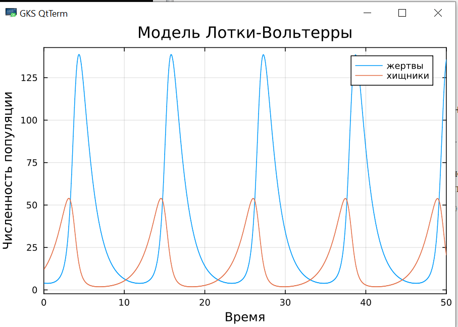
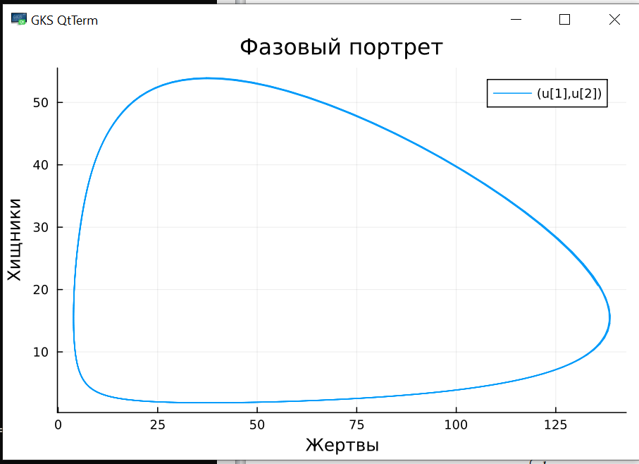
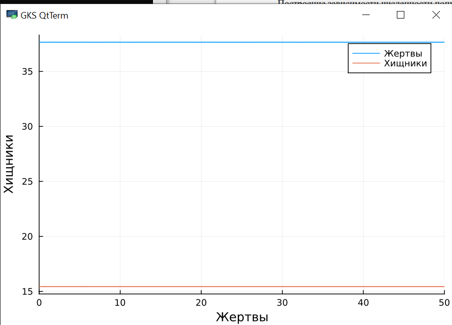

---
## Front matter
lang: ru-RU
title: Лабораторная работе №5
subtitle: "Математическое моделирование"
author:
  - Ищенко Ирина
institute:
  - Российский университет дружбы народов, Москва, Россия

## i18n babel
babel-lang: russian
babel-otherlangs: english

## Formatting pdf
toc: false
toc-title: Содержание
slide_level: 2
aspectratio: 169
section-titles: true
theme: metropolis
header-includes:
 - \metroset{progressbar=frametitle,sectionpage=progressbar,numbering=fraction}
 - '\makeatletter'
 - '\beamer@ignorenonframefalse'
 - '\makeatother'
---


## Докладчик

  * Ищенко Ирина Олеговна
  * уч. группа: НПИбд-02-22
  * Факультет физико-математических и естественных наук
  * Российский университет дружбы народов


## Цель работы

Исследовать математическую модель Лотки-Вольтерры.

## Задание

**Вариант 50**

Для модели «хищник-жертва»:

$$\begin{cases}
    &\dfrac{dx}{dt} = - 0.71 x(t) + 0.046 x(t)y(t) \\
    &\dfrac{dy}{dt} = 0.64 y(t) - 0.017 x(t)y(t)
\end{cases}$$

Построить график зависимости численности хищников от численности жертв,
а также графики изменения численности хищников и численности жертв при следующих начальных условиях:
$x_0 = 4, y_0 = 12.$ 
Найти стационарное состояние системы.


# Выполнение лабораторной работы

##

```Julia

# Используемые библиотеки
using DifferentialEquations, Plots;

# задания системы ДУ, описывающей модель Лотки-Вольтерры
function LV(u, p, t)
    x, y = u
    a, b, c, d = p
    dx = a*x - b*x*y
    dy = -c*y + d*x*y
    return [dx, dy]
end

# Начальные условия
u0 = [4,12]
p = [-0.71, -0.046, -0.64, -0.017]
tspan = (0.0, 50.0)
prob = ODEProblem(LV, u0, tspan, p)
sol = solve(prob, Tsit5())

# Постановка проблемы и ее решение
plot(sol, title = "Модель Лотки-Вольтерры", xaxis = "Время", yaxis = "Численность популяции", label = ["жертвы" "хищники"])
```

##

{#fig:001 width=70%}

##

{#fig:002 width=70%}

##

```Julia
x_c = p[3]/p[4]
y_c = p[1]/p[2]
u0_c = [x_c, y_c]
prob2 = ODEProblem(LV, u0_c, tspan, p)
sol2 = solve(prob2, Tsit5())

plot(sol2, xaxis = "Жертвы", yaxis = "Хищники", label = ["Жертвы" "Хищники"])
```

##

{#fig:003 width=70%}

##

```
model lab5_1
  parameter Real a = -0.71;
  parameter Real b = -0.046;
  parameter Real c = -0.64;
  parameter Real d = -0.017;
  parameter Real x0 = 4;
  parameter Real y0 = 12;

  Real x(start=x0);
  Real y(start=y0);
equation
    der(x) = a*x - b*x*y;
    der(y) = -c*y + d*x*y;
end lab5_1;
```

##

{#fig:004 width=70%}

##

{#fig:005 width=70%}

##

```
model lab5_2
  parameter Real a = -0.71;
  parameter Real b = -0.046;
  parameter Real c = -0.64;
  parameter Real d = -0.017;
  parameter Real y0 = 0.71/0.046;
  parameter Real x0 = 0.64/0.017;

  Real x(start=x0);
  Real y(start=y0);
equation
    der(x) = a*x - b*x*y;
    der(y) = -c*y + d*x*y;
end lab5_2;
```

##

{#fig:006 width=70%}


## Выводы

В ходе выполнения лабораторной работы я исследовала математическую модель Лотки-Вольтерры.


